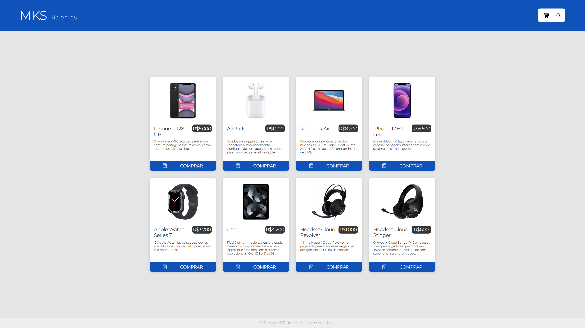
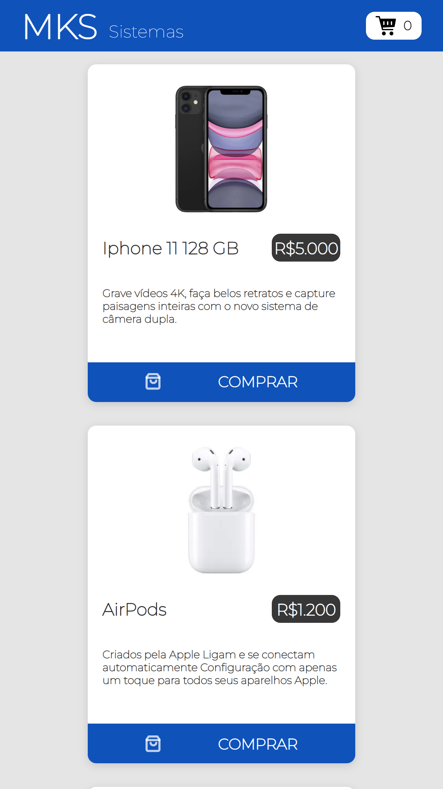
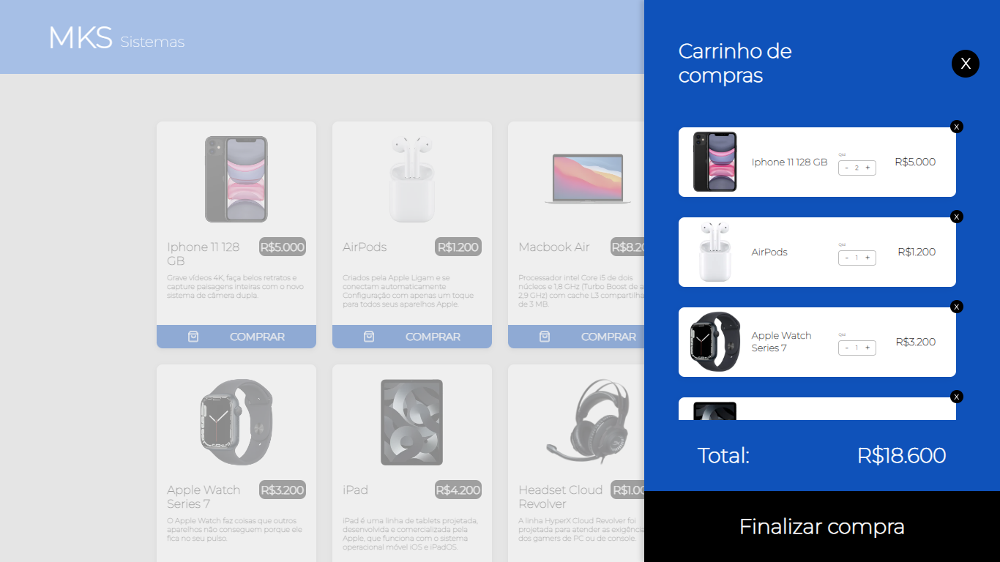
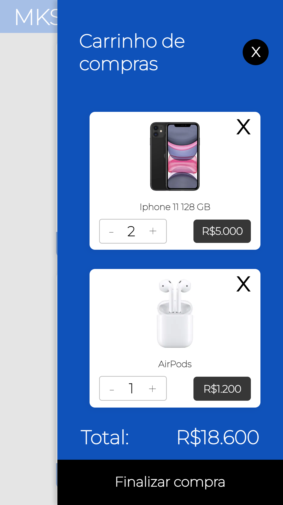
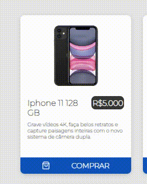
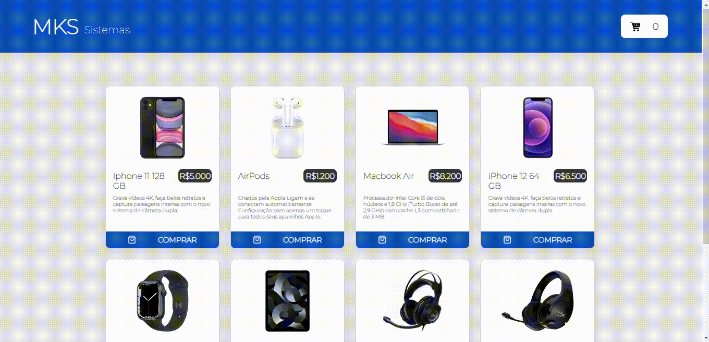

# Desafio Loja - MKS Sistemas

Desafio proposto pela MKS Sistemas, que consiste em montar uma aplicação front-end para compras online, com os itens sendo capturados do servidor back-end da companhia.

Link disponível neste [Link](https://desafio-loja-mks.vercel.app/).

## O que foi utilizado?
- React.js
- TypeScript
- Redux
- Styled Components
- Axios
- Jest
- Vercel (deploy)

## Resultado final:

### Página principal

Desktop

Mobile

### Lista de itens

Desktop

Mobile

## Funcionalidades não solicitadas
- **Não existe a duplicata de compra**. O produto, uma vez clicado em "Comprar", a aplicação permite apenas o incremento e o decremento da quantidade (sendo o último limitado a 1 produto) e a exclusão do item;

- **Propriedades CSS sobre o cursor do mouse, indicando áreas clicáveis ou não**. Está habilitado no botão "Comprar", o de Quantidade (que não permite o item ter quantidade menor que 1) e no botão "Finalizar compra";

- **Foco na lista de compras quando clicado**, mantendo os componentes abaixo dela desfocados;

- Ao clicar em qualquer campo fora da lista de compras, ela é fechada;

- Ainda na lista, uma vez aberto, os botões de compra ficam desabilitados;
- O botão "Finalizar compra" fica válido **apenas** quando existe um valor total maior que zero. Sendo clicado, a aplicação volta com os dados iniciais.